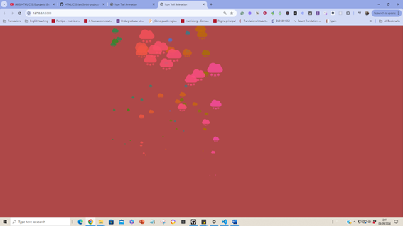

## Mouse Tracker Effect

This JavaScript project creates an interactive mouse tracking effect on a webpage. The script dynamically generates and animates elements that follow the user's mouse movements across the screen, creating a visually engaging trail effect.

## Features

Mouse Tracking: The script listens for mousemove events and tracks the mouse's position on the webpage.
Dynamic Element Creation: Each time the mouse moves, a new span element is generated at the cursor's location.
Random Sizing: The size of each generated element is randomised, adding variety to the effect.
Automatic Cleanup: Elements are automatically removed from the DOM after 3 seconds to prevent cluttering and excessive memory usage.

## Demo

You can see the effect in action by simply moving your mouse around the webpage.

## Usage

This project is straightforward and doesn't require any dependencies. You can modify the index.js file to customise the effect, such as changing the lifespan of the elements or their size range.

Customisation
You can easily customise the following aspects of the effect:

Size of the Elements: Adjust the range of sizeIcon to control the maximum and minimum size of the generated elements.
Element Lifespan: Change the duration of the setTimeout function to control how long the elements stay on the screen.
Appearance: Modify the CSS styles applied to the span elements for different shapes, colours, or other effects.
Contributing
Contributions are welcome! If you have ideas for improvements or new features, feel free to fork the project and submit a pull request.

## License

This project is licensed under the MIT License. See the LICENSE file for details.

## Acknowledgements

Thanks to the open-source community for the inspiration and tools that make projects like this possible, especially to the Youtube Channel Javascript King

## Visuals

